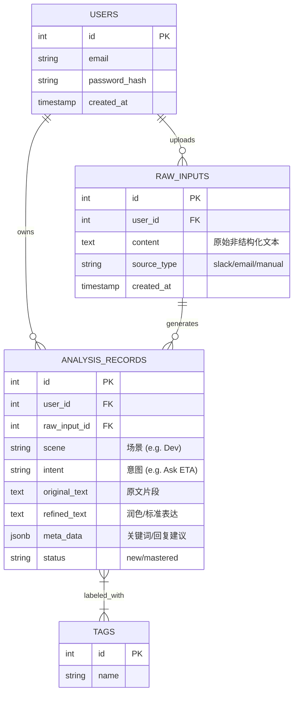

# Worklingo Database Schema Design

本文档描述了 Worklingo MVP 版本的数据库设计，用于支持从非结构化文本输入到结构化知识库的持久化存储。

## 1. 实体关系图 (ER Diagram)



## 2. 表结构定义 (Table Definitions)

### 2.1 Users (用户表)
存储用户的基本认证信息。

| Field | Type | Constraint | Description |
| :--- | :--- | :--- | :--- |
| `id` | SERIAL | PRIMARY KEY | 用户唯一标识 |
| `email` | VARCHAR(255) | UNIQUE, NOT NULL | 登录邮箱 |
| `password_hash` | VARCHAR(255) | NOT NULL | 加密后的密码 |
| `username` | VARCHAR(100) | | 用户昵称 |
| `created_at` | TIMESTAMP | DEFAULT NOW() | 注册时间 |

### 2.2 RawInputs (原始语料表)
存储用户最初粘贴或导入的非结构化文本。这是数据的源头，用于追溯。

| Field | Type | Constraint | Description |
| :--- | :--- | :--- | :--- |
| `id` | SERIAL | PRIMARY KEY | 记录ID |
| `user_id` | INTEGER | FK -> Users.id | 所属用户 |
| `content` | TEXT | NOT NULL | 原始文本内容 (Slack记录, 邮件全文等) |
| `source_type` | VARCHAR(50) | | 来源类型: `manual_paste`, `slack`, `email`, `zoom` |
| `created_at` | TIMESTAMP | DEFAULT NOW() | 导入时间 |

### 2.3 AnalysisRecords (结构化分析记录表)
这是系统的核心表。存储经过 AI 分析、提炼后的结构化知识单元。一条原始输入 (`RawInput`) 可能会产生多条分析记录（例如一段对话包含两个不同的意图）。

| Field | Type | Constraint | Description |
| :--- | :--- | :--- | :--- |
| `id` | SERIAL | PRIMARY KEY | 记录ID |
| `user_id` | INTEGER | FK -> Users.id | 所属用户 (冗余存储以优化查询) |
| `raw_input_id` | INTEGER | FK -> RawInputs.id | 关联的原始输入源 (可为空) |
| `scene` | VARCHAR(100) | | **场景**：如 "Product Discussion", "Code Review" |
| `intent` | VARCHAR(100) | | **意图**：如 "Ask for ETA", "Report Bug" |
| `original_text` | TEXT | | 提取的相关原文片段 |
| `refined_text` | TEXT | | **核心表达**：润色后的地道表达或推荐句式 |
| `explanation` | TEXT | | AI 的解释或语法备注 |
| `meta_data` | JSONB | | 扩展数据：包含 `keywords` (数组), `response_guide` (字符串), `urgency` 等 |
| `status` | VARCHAR(50) | DEFAULT 'new' | 状态: `new` (待复习), `reviewed` (已复习), `mastered` (已掌握) |
| `created_at` | TIMESTAMP | DEFAULT NOW() | 创建时间 |
| `updated_at` | TIMESTAMP | DEFAULT NOW() | 更新时间 |

### 2.4 Tags (标签表 - 可选)
用于灵活的分类管理。

| Field | Type | Constraint | Description |
| :--- | :--- | :--- | :--- |
| `id` | SERIAL | PRIMARY KEY | 标签ID |
| `name` | VARCHAR(50) | UNIQUE | 标签名 |

---

## 3. SQL 初始化语句 (SQLite/PostgreSQL 兼容)

```sql
-- Create Users Table
CREATE TABLE IF NOT EXISTS users (
    id SERIAL PRIMARY KEY,
    email VARCHAR(255) UNIQUE NOT NULL,
    password_hash VARCHAR(255) NOT NULL,
    username VARCHAR(100),
    created_at TIMESTAMP DEFAULT CURRENT_TIMESTAMP
);

-- Create RawInputs Table
CREATE TABLE IF NOT EXISTS raw_inputs (
    id SERIAL PRIMARY KEY,
    user_id INTEGER NOT NULL REFERENCES users(id) ON DELETE CASCADE,
    content TEXT NOT NULL,
    source_type VARCHAR(50) DEFAULT 'manual_paste',
    created_at TIMESTAMP DEFAULT CURRENT_TIMESTAMP
);

-- Create AnalysisRecords Table
CREATE TABLE IF NOT EXISTS analysis_records (
    id SERIAL PRIMARY KEY,
    user_id INTEGER NOT NULL REFERENCES users(id) ON DELETE CASCADE,
    raw_input_id INTEGER REFERENCES raw_inputs(id) ON DELETE SET NULL,
    scene VARCHAR(100),
    intent VARCHAR(100),
    original_text TEXT,
    refined_text TEXT,
    explanation TEXT,
    meta_data TEXT, -- 在 SQLite 中使用 TEXT 存储 JSON，PostgreSQL 使用 JSONB
    status VARCHAR(50) DEFAULT 'new',
    created_at TIMESTAMP DEFAULT CURRENT_TIMESTAMP,
    updated_at TIMESTAMP DEFAULT CURRENT_TIMESTAMP
);

-- Indexes for performance
CREATE INDEX idx_records_user_id ON analysis_records(user_id);
CREATE INDEX idx_records_scene ON analysis_records(scene);
CREATE INDEX idx_records_intent ON analysis_records(intent);
```
